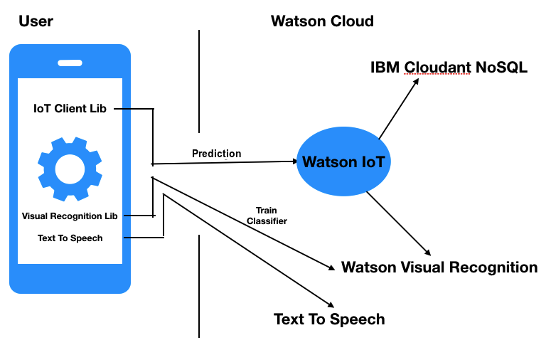
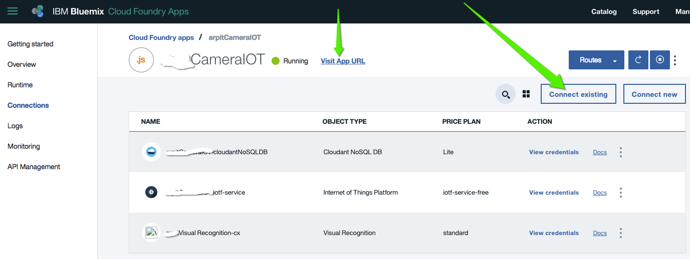
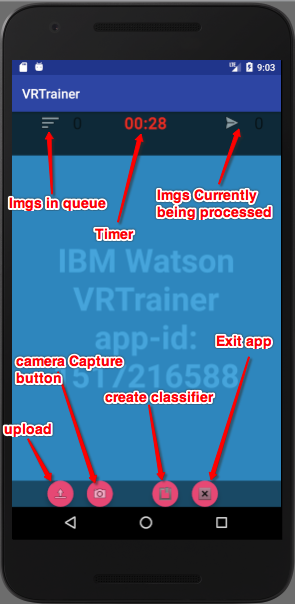
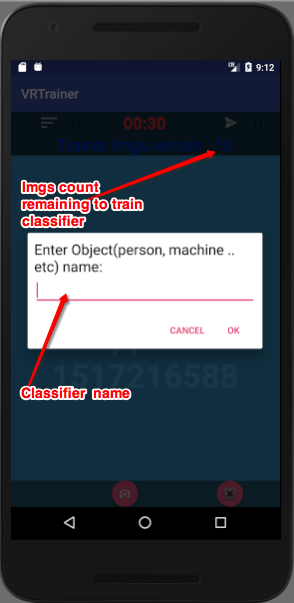

IBM Scavenger Hunting and Image Training through Android powered by IBM Watson

In this developer journey we will create Scavenger Hunt game and a Image training app for Android device based on Watson's below services:

1. Text To Speech(TTS)
3. Visual Recognition(VR)
4. Watson IoT
5. Cloudant NoSQL storage service

Architecture:

This scavenger app consists of below two applications:
1. Training App(to create and train a new custom classifier using Watson's VR)
2. Scavenger App(to demonstrate the prediction results of each image through created custom classifier including default one.)

After completing this journey you will understand how to:
a. Authorize a person through creating a custom classifier in IBM Watson visual recognition.
b. User friendly interaction by playing WAV stream received by calling Text to Speech.
c. Store Images on cloud using IBM bluemix Cloudant DB service available on Watson IoT.

Dependency:

Note: this app has been tested on android with : minSdkVersion 21
For more details please refer <a href="STest/app/build.gradle">this</a> build.gradle file.

Pre Requisite:

1. goto bluemix catalog home page and under "Apps" select "Boilerplates".
2. click "Internet of Things Platform Starter".
3. Enter app name and other required inputs and click "create" button.
4. This will configure below three things for you to start with IoT stuff:
	* Node-Red JS sdk
	* IoT Platform service
	* Cloudant NoSQL DB service
5. get the credentials for below services:
	a. Speech to Text
	b. Text to Speech
	c. Visual Recognition
	d. IoT (created in previus step)
	e. Cloudant NoSQL(created in previus step)
   			You can mannually add your precreated Watson services as shown below by clicking to "Connections" in left menu panel.

Before you begin:

a. Register your IoT device on WatsonIoTPlatform:

	1. goto your Bluemix services catalog and click IOT-service created in previous step.
	2. On this page you will see Launch button, click this. This will open saperate IBM Watson IoT Platform home page for your service.
	3. Select DEVICES option in left menu panel.
	4. Click on "+Add Device" button. Now follow the steps mentioned here: https://console.bluemix.net/docs/services/IoT/iotplatform_task.html#iotplatform_task'
	5. Once you register your device update below to your properties file which we will create in next step:

		Organization ID xxxx
		Device Type xxxxx
		Device ID xxxxx
		Authentication xxxxxx
		Authentication Token xxxxxx

b. create Node-Red device simulator to receive events/send notification back to IoT device.

	1. goto the home page of boilerplate app created in Pre Requisite steps.
	2. click "overview" menu option in left page panel.
	3. on curren page you will see "Visit App URL" hyper link. This will load your Node-Red editor in saperate page.
	4. On this Node Red editor page cllick menu on top right corner and select 'Import' -> 'Clipboard'.
	5. In pop up input dialog copy and paste from NodeRedJsIoTReciever.json file provided below :
	                https://github.com/arprasto/ScavengerHuntGame/blob/master/NodeRedJSIoTReciever.json
	6. Click on 'Deploy' button.

How to build and run it:

Coding the app on Android Studio

Android Studio is the Official IDE for Android. Android Studio provides the fastest tools for building apps on every type of Android device.
Clone the repo and import the code in Android Studio,

git clone https://github.com/IBM-Bluemix/chatbot-watson-android.git

Watson Configuration Parameters(watson_config.xml)

Navigate to file app/src/main/res/values/watson_config.xml and provide Bluemix service credentials

    <!-- Watson Text To Speech service credentials-->
    <string name="tts_uname">xxxxxxxxx</string>

    <string name="tts_pass">xxxxxxxxx</string>


    <!-- Watson IoT device details-->
    <string name="Organization_ID">xxxxxxxxx</string>

    <string name="type">xxxxxxxxx</string>

    <string name="id">xxxxxxxxx</string>

    <string name="Authentication_Token">xxxxxxxxx</string>

    <string name="Authentication_Method">token</string>

    <string name="iot_event_for_img_base64">capture_store</string>


    <!-- Watson Visual Recognition service credentials-->
    <string name="vr_api_key">xxxxxxxxx</string>

    <string name="vr_classifier_name">DemoClassifier</string>


Home screen for Scavenger :

Training screen :

How to see VR Results:

Please refer ScavengerWebResultApp here : https://github.com/arprasto/ScavengerWebResultApp